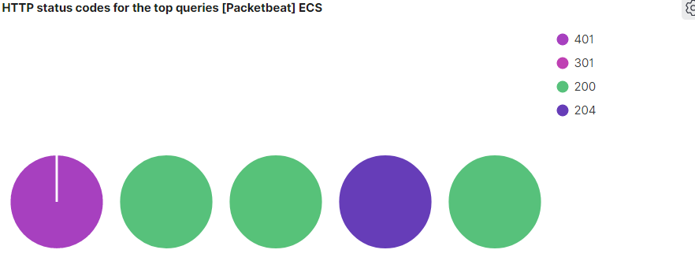
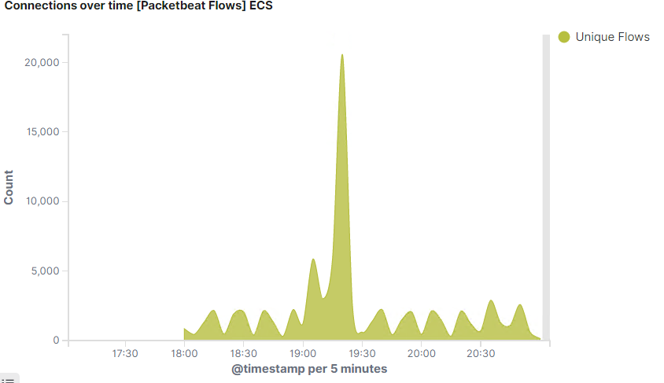
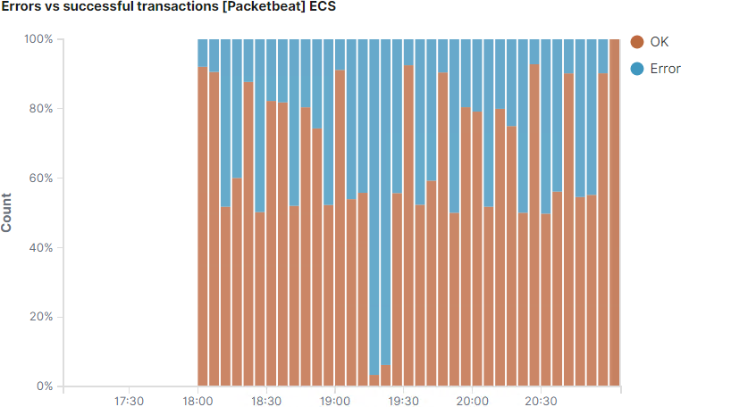
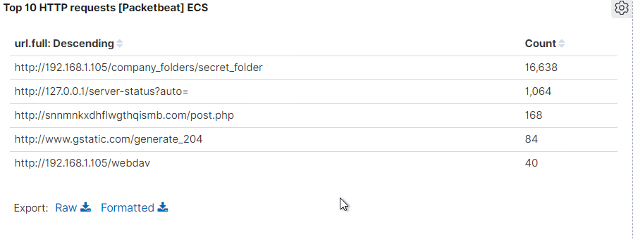
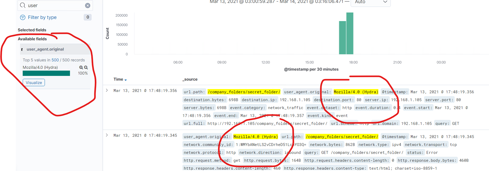
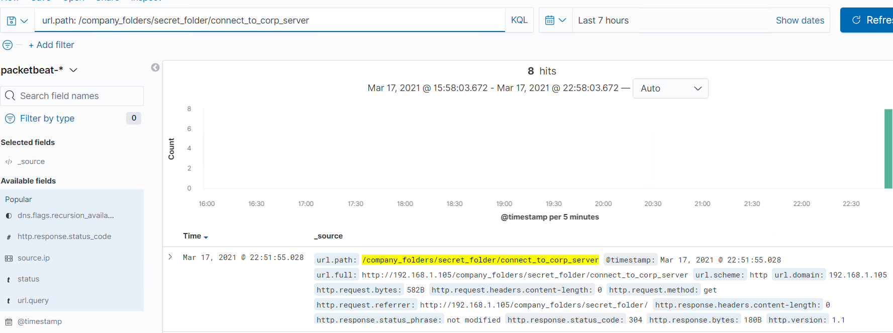
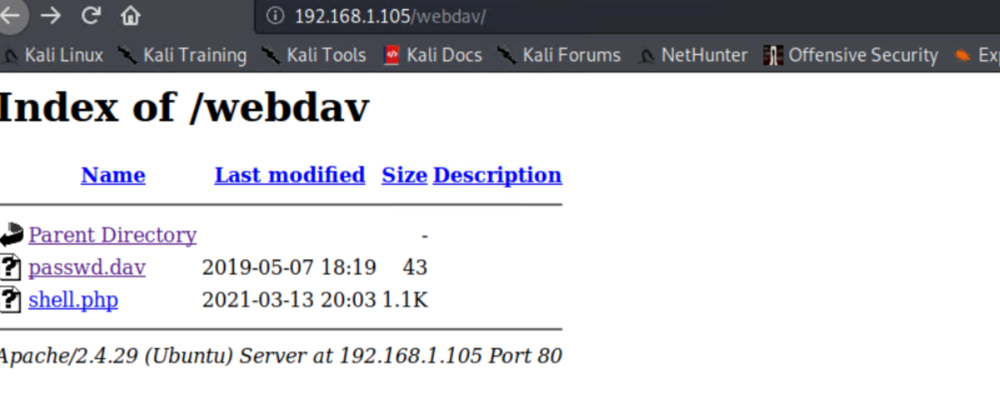
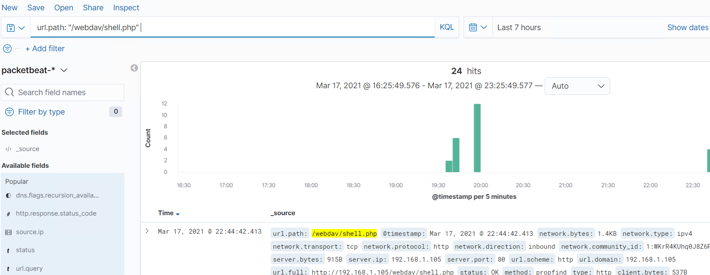

Staring with a few searches in the 'Discover' area, we can find some interesting interactions.

I ran source.ip: 192.168.1.90 and destination.ip: 192.168.1.105 in which the source IP is your Kali machine and your destination machine is your web server.

Ran url.path: /company_folders/secret_folder/

1. Identify the offensive traffic.
   - Identify the traffic between your machine and the web machine:
     - When did the interaction occur?

          - Mar 13, 2021 @ 17:31:48.888

     - What responses did the victim send back?

          - top responses are: 401 , 301 , 200, 204. And 301 , 302 , 303 , 304, and 400

  Proof Victim's Reponses Sent Back

    - HTTP Status Codes for the Top Queries [Packetbeat] ECS:   
       

    - HTTP Error Codes [Packetbeat] ECS:
     

     - What data is concerning from the Blue Team perspective?

          - Graphs from Connections over time [Packetbeat Flows] & Errors vs successful transactions [Packetbet] ECS shows that there is something to be concerned with.

  See proofs in graphs below:
    
    - Connection Over Time [Packetbeat Flows] ECS 
      

    - Error vs. Successful Transactions [Packetbeat] ECS 
     

2. Find the request for the hidden directory.
   - In your attack, you found a secret folder. Let's look at that interaction between these two machines.

     - How many requests were made to this directory? At what time and from which IP address(es)?

          - 16,638 Requests at 19:27 and from 192.168.1.90 to 192.168.1.105
      - Top 10 HTTP Requests [Packetbeat] ECS

        
      - Looking at the Top 10 HTTP Requests [Packetbeat] ECS  we can see that the "secret_folder" was requested 16,638 times.

     - Which files were requested? What information did they contain?
        - Per above image, we can see that ,  connect_to_corp_server , file was requested 3 times.

     - What kind of alarm would you set to detect this behavior in the future?
        - Block or restrict access to this file and all files and directories
     - Identify at least one way to harden the vulnerable machine that would mitigate this attack.

        - Close all unnecessary ports.
        - Harden user priviledges 
        - Harden user accounts with stronger passwords
        - Teach constant Digital Security awareness
        - Remove any and all unnecessary files and directories from unauthorized access. 

3. Identify the brute force attack.
   - After identifying the hidden directory, you used Hydra to brute-force the target server. Answer the following questions:

     - Can you identify packets specifically from Hydra?
        
        - Running url.path: '/company_folders/secret_folder/' > then filter to 'user_agent.original' > results = Mozilla/4.0 (Hydra) as seen below.

      

     - How many requests were made in the brute-force attack?
        - The attacker made 16,638 request

     - How many requests had the attacker made before discovering the correct password in this one?
        
         - 16,638 requests were made and 8 were successful
         

     - What kind of alarm would you set to detect this behavior in the future and at what threshold(s)?

         - Set password attempts to 3 maximum before a lock out. And
         - Set an Unauthorized 401 or any other type unauthorized access.
         - Set an alert for any balues including ozilla (Hydra)

     - Identify at least one way to harden the vulnerable machine that would mitigate this attack.
        - Set lock out after a certain number of failed/ wrong attempts could help mitigate.

4. Find the WebDav connection.
   - Use your dashboard to answer the following questions:

     - How many requests were made to this directory? 
     
      - Looking at the above image, 60 requests were made to the 'Webdav' directory
     
     - Which file(s) were requested?

        - The shell.php and passwd.dav were requested, see below:
        

     - What kind of alarm would you set to detect such access in the future?
         - We can set an alert to trigger any unauthorized access to this directory.

     - Identify at least one way to harden the vulnerable machine that would mitigate this attack.
          - Remove access to this to 'webdav' and any sensitive direction from public/web access
          - A firewall rule could be set in place.

5. Identify the reverse shell and meterpreter traffic.
   - To finish off the attack, I uploaded the shell.php file, and you can see that it on the discovery search.

     

     - Can you identify traffic from the meterpreter session?
       - source.ip: 192.168.1.105 and destination.port: 4444
     - What kinds of alarms would you set to detect this behavior in the future?
         - We can set alarm for any traffic using port 4444
         - We can also set alarm for any uploads eg: files like .php
     - Identify at least one way to harden the vulnerable machine that would mitigate this attack.
          - Hardening the authorized user's password could help as 'linux4u' is a really easy password to crack via brute force/ wordlist
          - Removing/restricting the ability to upload files into the directory via a web interface would help prevent this issue.

---
© 2020 Trilogy Education Services, a 2U, Inc. brand. All Rights Reserved.
