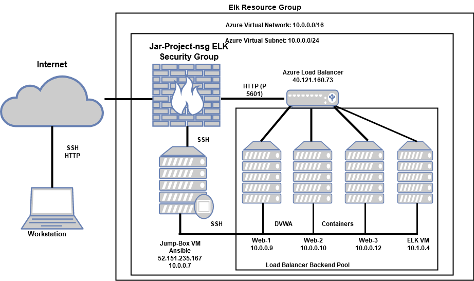
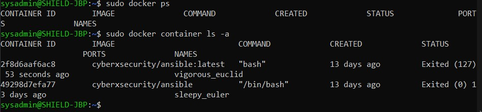
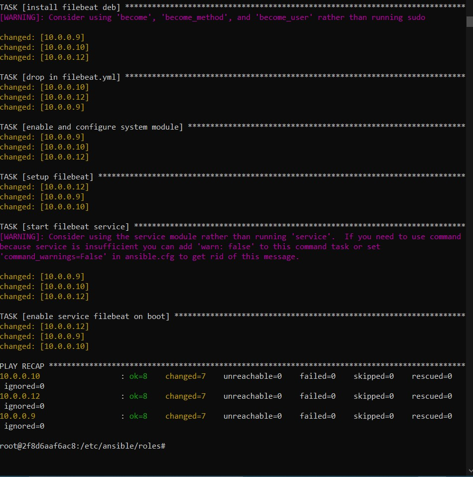

## Automated ELK Stack Deployment

The files in this repository were used to configure the network depicted below.

These files have been tested and used to generate a live ELK deployment on Azure. They can be used to either recreate the entire deployment pictured above. Alternatively, select portions of the Elk_ResourceGroup_Diagram file may be used to install only certain pieces of it, such as Filebeat.

[Elk_Playbook](Ansible/Elk_Playbook.yml) 
[Elk_playbook](https://github.com/jarlamin/zona/blob/main/Ansible/Elk_Playbook.yml)

This document contains the following details:
- Description of the Topologu
- Access Policies
- ELK Configuration
  - Beats in Use
  - Machines Being Monitored
- How to Use the Ansible Build

### Description of the Topology

The main purpose of this network is to expose a load-balanced and monitored instance of DVWA, the D*mn Vulnerable Web Application.

Load balancing ensures that the application will be highly reliable (secured and available), in addition to restricting access/traffic to the network.
- What aspect of security do load balancers protect?  

A load Balancer adds additonal layers of security to a website/ server without any changes to your application. The off-loading function of a load balancer defends an organization against distributed denial-of-service (DDoS) attacks. It does this by shifting attack traffic from the corporate server to a public cloud provider. is the process of distributing workloads across multiple servers, collectively known as a server cluster. The main purpose of load balancing is to prevent any single server from getting overloaded and possibly breaking down. The Web Application Firewall (WAF) in the load balancer protects your website from hackers and includes daily rule updates just like a virus scanner. The load balancer can Authenticate User Access by requesting a username and password before granting access to a website to protect against unauthorized access. 

 - What is the advantage of a jump box?

 A jump box is a secure computer that all admins first connect to before launching any administrative task or use as an organization point to connect to other servers or untrusted environments. It is an intermediary host or an SSH gateway to a remote network, through which a connection can be made to another host in a dissimilar security zone, for example a demilitarized zone (DMZ). It bridges two dissimilar security zones and offers controlled access between them.

Integrating an ELK server allows users to easily monitor the vulnerable VMs for changes to the __logs__files_ and system _traffic logs.

- What does Filebeat watch for?

    Filebeat monitors the log files or locations that are specified, collects log events, and forwards them either to Elasticsearch or Logstash for indexing.
    
- What does Metricbeat record?

   Metricbeat is a lightweight shipper that you can install on your servers to periodically collect metrics from the operating system and from services running on the server. Metricbeat takes the metrics and statistics that it collects and ships them to the output that you specify, such as Elasticsearch or Logstash.

The configuration details of each machine may be found below.
_Note: Use the [Markdown Table Generator](http://www.tablesgenerator.com/markdown_tables) to add/remove values from the table_.

| Name     | Function | IP Address | Operating System |
|----------|----------|------------|------------------|
| Jump Box | Gateway  | 10.0.0.7   | Linux            |
| Web-1    | DVWA     | 10.0.0.10  | Linux            |
| web-2    | DVWA     | 10.0.0.9   | Linux            |
| Web-3    | ELK      | 10.0.0.12  | Linux            |
| Jar_ELK  | ELK      | 10.1.0.4   | Linux            |

### Access Policies

The machines on the internal network are not exposed to the public Internet. 

Only the Jump Box machine can accept connections from the Internet. Access to this machine is only allowed from the following IP addresses:
-   (Local Host IP Address)

Machines within the network can only be accessed by:
- Jump-Box-Provisioner

- Which machine did you allow to access your ELK VM?      

- Jump-Box-Provisioner

What was its IP address? 

- 10.0.0.7 (Private Web-1)

A summary of the access policies in place can be found in the table below.

| Name     | Publicly Accessible | Allowed IP Addresses |
|----------|---------------------|----------------------|
| Jump Box | Yes                 | (Home IP)       |
| Web-1    | No                  | 10.0.0.7/ loadbalancer ip |
| Web-2    | No                  | 10.0.0.10/ LBalancer ip   |
| Web-3    | N0                  | 10.0.0.12/LB IP           |
| Jar_ELK  | N0                  | 10.1.0.4/ LB IP           |

### Elk Configuration

Ansible was used to automate configuration of the ELK machine. No configuration was performed manually, which is advantageous because...

The primary benefit of Ansible is it allows IT administrators to automate away the drudgery from their daily tasks. That frees them to focus on efforts that help deliver more value to the business by spending time on more important tasks_ 

The playbook implements the following tasks:

- Install Python3-pip
- Install Docker using pip
- Install ELK
- Enable docker service on restart

The following screenshot displays the result of running `docker ps` after successfully configuring the ELK instance.

 

### Target Machines & Beats
This ELK server is configured to monitor the following machines:
- 10.0.0.10(Web-1), 10.0.0.9(web-2), 10.0.0.12(web-2)

We have installed the following Beats on these machines:

- Specify which Beats you successfully installed filebeat and metricbeat

The following shows successful Filebeat Installation

These Beats allow us to collect the following information from each machine:

- In 1-2 sentences, explain what kind of data each beat collects, and provide 1 example of what you expect to see. E.g., `Winlogbeat` collects Windows logs, which we use to track user logon events, etc._

- Filebeat monitors the log files or locations that you specify, collects log events, and forwards them either to Elasticsearch or Logstash for indexing.

- Metricbeat is a lightweight shipper that you can install on your servers to periodically collect metrics from the operating system and from services running on the server. Metricbeat takes the metrics and statistics that it collects and ships them to the output that you specify, such as Elasticsearch or Logstash__ 

### Using the Playbook
In order to use the playbook, you will need to have an Ansible control node already configured. Assuming you have such a control node provisioned: 

SSH into the control node and follow the steps below:
----Filebeat---

- Copy the filebeat-configuration.yml file to /etc/ansible/roles/files.
- Update the hosts file to include the IPs of the Virtual Machines (Web-1 10.0.0.10, Web_2 10.0.0.9, Web_3 10.0.0.12 and elk_project 10.1.0.4 )
- Run the playbook, and navigate to 23.100.127.27:5601/app/kibana (this is the elk-VM Public IP) to check that the installation worked as expected.

---Metricbeat---

  - Copy the metricbeat-configuration.yml file to /etc/ansible/roles/files.
  - Update the metricbeat-configuration.yml file to include the ELK private IP in lines 62 and 96.
  -Run the playbook, and navigate to 23.100.127.27:5601/app/kibana (This is the elk-VM Public IP) to check that the installation worked as expected.

 Answer the following questions to fill in the blanks:_

- Which file is the playbook? 
   - filebeat-playbook.yml
- Where do you copy it? 
   - /etc/ansible/roles
- Which file do you update to make Ansible run the playbook on a specific machine? 
  - /etc/ansible/hosts file (IP of the Virtual Machines).
- How do I specify which machine to install the ELK server on versus which to install Filebeat on? 
  - I have to specify two separate groups in the etc/ansible/hosts file. One of the groups will be webservers which has the IPs of the VMs that I will install Filebeat to. The other group is named elkservers which will have the IP of the VM I will install ELK to.
- Which URL do you navigate to in order to check that the ELK server is running? http://23.100.127.27:5601/app/kibana

_As a **Bonus**, provide the specific commands the user will need to run to download the playbook, update the files, etc._

 -------Filebeat---------

- To create the filebeat-configuration.yml file: nano filebeat-configuration.yml. For this, I used the filebeat configuration file template.

- To create the playbook: nano filebeat-playbook.yml

  ---
 - name: installing and launching filebeat
	   hosts: webservers
       become: true
       tasks:

	   - name: download filebeat deb
  	     command: curl -L -O https://artifacts.elastic.co/downloads/beats/filebeat/filebeat-7.7.1-amd64.deb

	   - name: install filebeat deb
  	     command: dpkg -i filebeat-7.7.1-amd64.deb

	   - name: drop in filebeat.yml
  	     copy:
   	       src: ./files/filebeat-configuration.yml
   	       dest: /etc/filebeat/filebeat.yml

	   - name: enable and configure system module
  	     command: filebeat modules enable system

	   - name: setup filebeat
  	     command: filebeat setup

	   - name: start filebeat service
  	    command: service filebeat start
---
-To run the playbook: ansible-playbook filebeat-playbook.yml

* In order to run the playbook, you have to be in the directory the playbook is at, or give the path to it (ansible-playbook /etc/ansible/roles/filebeat-playbook.yml

-------Metricbeat-------

- To create the metricbeat-configuration.yml file: nano metricbeat-configuration.yml. For this, I used the metricbeat configuration file template.

- To create the playbool: nano metricbeat-playbook.yml

---
  - name: installing and lunching metricbeat
    hosts: webservers
    become: true
    tasks:
    
  - name: download metricbeat deb
    command: curl -L -O https://artifacts.elastic.co/downloads/beats/metricbeat/metricbeat-7.7.1-amd64.deb
    
  - name: install metricbeat deb
    command: sudo dpkg -i metricbeat-7.7.1-amd64.deb
    
  - name: drop in metricbeat.yml
    copy:
      src: /etc/ansible/roles/files/metricbeat-configuration.yml
      dest: /etc/metricbeat/metricbeat.yml
      
   - name: enable and configure system module
     command: metricbeat modules enable system
     
   - name: setup metricbeat
     command: metricbeat setup
     
   - name: start metricbeat service
     command: service metricbeat start
     
   ---
   
   - To run the playbook: ansible-playbook metricbeat-playbook.yml
   
   * To order to run the playbook, you have to be in the directory the playbook is at, or give the path to it (ansible-playbook /etc/ansible/roles/metricbeat-playbook.yml